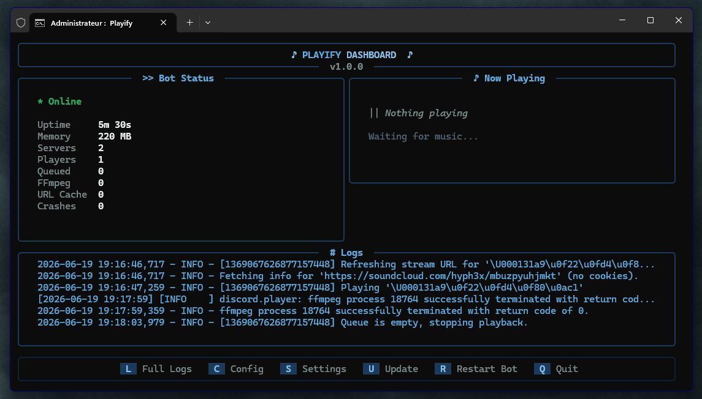

<p align="center">
  
</p>

<h1 align="center">Playify V2</h1>

<p align="center">
  <a href="https://github.com/alan7383/playify/blob/main/LICENSE">
    
  </a>
  
  
</p>

<p align="center">
  <strong>A minimalist, self-hosted Discord music bot with a powerful TUI Dashboard.</strong>
</p>

---

### ~ V2 Update: The Ultimate Self-Hosted Experience

Playify has been completely rewritten to provide a seamless, robust, and beautiful experience directly from your terminal.

* **Interactive TUI Dashboard**: Monitor resources, queue length, active players, and logs in real-time through a beautiful ASCII interface.
* **Built-in Auto-Updater**: Keep your bot up to date directly from the dashboard. No `git pull` or manual downloads required.
* **One-Click Installer**: Double click `start.bat` and let Playify automatically install Python, download FFmpeg, and set up your `.env` configuration.
* **In-App Settings Menu**: Configure your bot's Discord presence, default volumes, and UI customization without touching a text file.

<p align="center">
  
</p>

---

### ~ What is this

Playify is an open-source Discord music bot built for simplicity. No web UI, no paywalls, no account required -- just slash commands and music.

It supports **YouTube, YouTube Music, SoundCloud, Twitch, Spotify, Deezer, Bandcamp, Apple Music, Tidal, Amazon Music, direct audio links, and local files**.

Type `/play <url or query>` and let it run.

---

### * Features

<details open>
<summary><b>~ Sources & Playback</b></summary>

* Play from **10+ sources**: YouTube, SoundCloud, Twitch, Spotify, Apple Music, etc.
* **Direct audio links**: stream any public MP3, FLAC, WAV, or audio URL.
* **Local file playback**: upload and play your own audio/video files directly.
* **Autoplay** of similar tracks via YouTube Mix and SoundCloud Stations.
* **Loop** and **shuffle** queue controls.
* Audio **filters**: slowed, reverb, bass boost, nightcore, and more.
</details>

<details>
<summary><b>> Spotify Support</b></summary>

* Individual tracks.
* Personal and public playlists.
* Spotify-curated mixes (Release Radar, Your Mix) via SpotifyScraper, bypassing API limits.
</details>

<details>
<summary><b>+ Extras</b></summary>

* **Lyrics** fetching and display for the current track.
* **Karaoke mode** with synced lyrics.
* **24/7 mode** to keep the bot in a channel permanently.
* **Kawaii Mode** -- toggle cute kaomoji responses with `/kaomoji`.
* **Interactive queue pages**, track removal menus, and a seek interface.
</details>

---

### > Install

<details open>
<summary><b>[ Windows - Recommended ]</b></summary>

1. Download the repository as a ZIP and extract it, or clone it via git.
2. Double-click `start.bat`.
3. The Playify installer will automatically install Python, download FFmpeg, and prompt you for your Discord Token.
4. The TUI Dashboard will launch automatically.
</details>

<details>
<summary><b>[ Docker ]</b></summary>

```bash
git clone https://github.com/alan7383/playify.git
cd playify
cp .env.example .env
```

Edit `.env` and fill in your tokens, then start the bot:

```bash
docker compose up -d --build
```
</details>

---

### # Commands

| Command | Description |
| :--- | :--- |
| `/play <url/query>` | Add a song or playlist. Supports direct audio links. |
| `/search <query>` | Search and choose from the top results. |
| `/play-files <file(s)>` | Play one or more uploaded audio/video files. |
| `/playnext <query/file>` | Add a song to the front of the queue. |
| `/pause` / `/resume` | Pause or resume playback. |
| `/skip` | Skip the current track. |
| `/stop` | Stop playback, clear queue, disconnect. |
| `/nowplaying` | Show current track info. |
| `/seek` | Interactive seek, fast-forward, or rewind menu. |
| `/queue` | Show the queue with interactive pages. |
| `/remove` | Open a menu to remove tracks from the queue. |
| `/shuffle` | Shuffle the queue. |
| `/clearqueue` | Clear all songs from the queue. |
| `/loop` | Toggle looping for the current track. |
| `/autoplay` | Toggle autoplay when the queue ends. |
| `/24_7 <mode>` | Keep the bot in the channel (`normal`, `auto`, `off`). |
| `/filter` | Apply real-time audio filters. |
| `/lyrics` | Fetch and display lyrics for the current song. |
| `/karaoke` | Start a karaoke session with synced lyrics. |
| `/reconnect` | Refresh the voice connection without losing your place. |
| `/kaomoji` | Toggle cute kaomoji responses. `(ADMIN)` |

---

### @ Troubleshooting

* **FFmpeg not found** -- The Windows `start.bat` handles this automatically. For manual setups, ensure FFmpeg 6.1.1 is in your PATH or `bin/` folder.
* **Spotify errors** -- check your `SPOTIFY_CLIENT_ID` and `SPOTIFY_CLIENT_SECRET` in `.env`.
* **Bot offline or unresponsive** -- verify your `DISCORD_TOKEN` and bot permissions in the Developer Portal.

---

### ~ Privacy

* **Self-hosted only**: all logs stay local to your machine. No telemetry is sent anywhere.

---

### + Under the hood

* **Python** & **discord.py**
* **yt-dlp** & **FFmpeg**
* **Rich** (TUI Dashboard)
* **Playwright** & **SpotifyScraper**

---

### * Contributing

Bugs, features, pull requests -- all welcome.

* **Found a bug?** Open an Issue.
* **Want a feature?** Fork the repo and open a Pull Request.
* **Like the project?** Star the repository!

---

### ~ License

MIT License -- do what you want with the code, just be kind.

---

<p align="center">
  made with love by <a href="https://github.com/alan7383">alan7383</a>
</p>