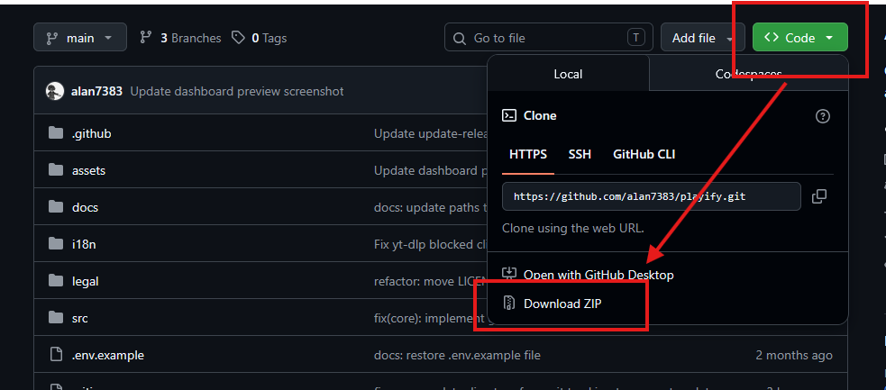

Playify provides seamless installation scripts to get you up and running as quickly as possible.

## Windows (recommended)

1. Download the repository as a ZIP from the [GitHub releases](https://github.com/alan7383/playify) or clone it via git.
   
   

2. Extract the ZIP file anywhere on your computer (make sure it's extracted, do not run from within the ZIP).
3. Double-click `start.bat`.
4. The Playify installer will automatically install Python, download FFmpeg, and prompt you for your Discord token and Spotify keys.
5. The TUI dashboard will launch automatically!

## Linux

Playify natively supports Linux with an automated setup script.

1. Clone the repository: 
```bash
git clone https://github.com/alan7383/playify.git
```
2. Enter the directory: 
```bash
cd playify
```
3. Run the bootstrapper: 
```bash
bash start.sh
```
4. The script will set up your virtual environment, automatically download a local copy of FFmpeg, and launch the dashboard.

## Docker

If you prefer using Docker:

1. Clone the repository:
```bash
git clone https://github.com/alan7383/playify.git
cd playify
cp .env.example .env
```
2. Edit `.env` and fill in your tokens.
3. Start the bot:
```bash
docker compose up -d --build
```

---

## Additional requirements & troubleshooting

Playify automatically downloads FFmpeg during `start.bat` and `start.sh` execution. However, if you are doing a pure manual installation or run into issues:

### FFmpeg (manual installation)
- **Windows**: download [FFmpeg](https://ffmpeg.org/download.html), extract it, and add the `bin` folder to your system PATH.
- **Linux**: install via package manager: `sudo apt install ffmpeg`.
