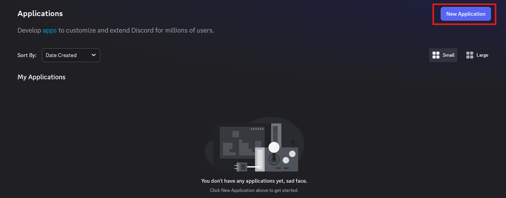
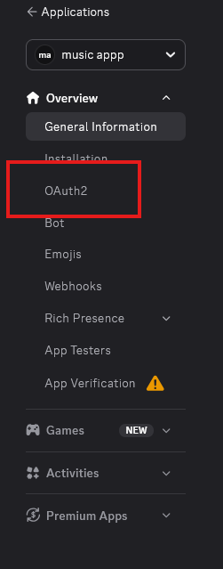
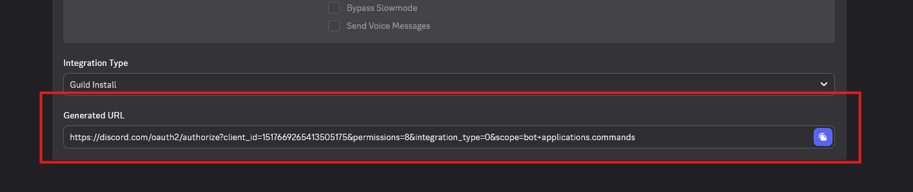

Once you have your bot running (or if you are setting up the bot application for the first time), you need to invite the bot to your Discord server! It does not join automatically.

Follow these steps to generate an invite link for your bot.

## 1. Go to the Developer Portal

Go to the [Discord Developer Portal](https://discord.com/developers/applications) and select your application. If you don't have one yet, you must create one by clicking **New Application**.

## 2. Open the URL Generator

In the sidebar on the left, click on **OAuth2**, and then select **URL Generator**.

## 3. Select Scopes and Permissions

To ensure Playify functions correctly and can register its slash commands, you must select the correct scopes and permissions.

### Scopes
Check the following boxes:
- `bot`
- `applications.commands`

### Bot Permissions
Once you check `bot`, a list of permissions will appear below. Check the following:
- `View Channels`
- `Send Messages`
- `Embed Links`
- `Read Message History`
- `Connect`
- `Speak`

*(Alternatively, if you trust your own bot and don't want to deal with specific permissions, you can simply check `Administrator`.)*

## 4. Generate and Open the URL

At the bottom of the page, a Generated URL will appear. Copy this URL and open it in a new tab in your web browser.

## 5. Invite to your Server

Select the server you want to add Playify to, and confirm. 

Once it's in, join a Voice Channel and use `/play` to start listening!
