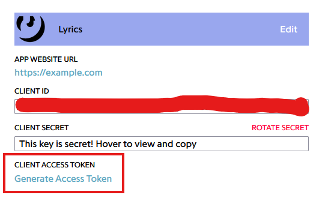

Playify supports fetching high-quality lyrics directly from Genius and displaying them in Discord.

## The Genius API Token

To power the lyrics feature, Playify requires a valid **Genius API Token**.
Without this token, the `/lyrics` and `/karaoke` commands will return an error, and the bot will fallback to standard music playback without text integration.

### Setting up the Token
1. Go to the [Genius API Clients Page](https://genius.com/api-clients/new) (you will need to create a free Genius account if you don't have one).
2. Fill out the **New API Client** form:
   - **App Name**: `Playify` (or any name you want)
   - **App Website URL**: `https://github.com/alan7383/playify` (or any valid URL)
   - **Redirect URI**: `http://localhost` (we only need the token, so this doesn't matter)
3. Click **Save**, then click on **Generate Access Token** to get your **Client Access Token**.
   
   
4. Place this token in your `.env` file or provide it directly in the TUI Setup Wizard when you first launch the bot.
   ```env
   GENIUS_TOKEN=your_token_here
   ```

## Getting Lyrics (`/lyrics`)

While a song is playing, you can run `/lyrics`.
The bot will search Genius for the title and artist of the currently playing track and return the lyrics in a paginated embed message. You can click through the pages to read along.

## Karaoke Mode (`/karaoke`)

For a more interactive experience, use the `/karaoke` command. This feature is powered by the open-source [syncedlyrics](https://github.com/moehmeni/syncedlyrics) Python library. 

When active, the bot attempts to sync the lyrics with the current timestamp of the song. The embed message will continuously edit itself to highlight the current verse being sung.

> [!WARNING]
> Karaoke mode requires Discord to process many message edits in a short time. If you use it excessively on a very large server, you may hit Discord's rate limits.
